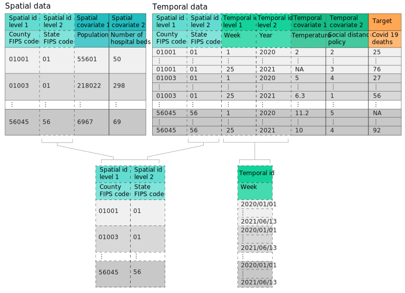
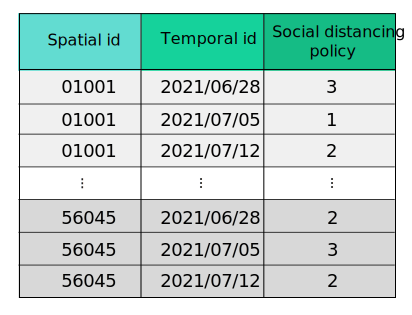
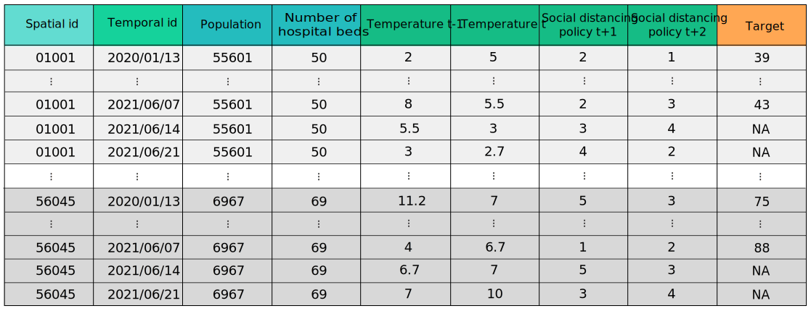

Data structure
==============

Raw data
--------

stpredict provides a flexible data structure to receive a spatio-temporal data in the functions. Input data of the preprocess module functions can be presented in two dataframes:

#. Temporal data:
   Temporal data (also called as time dependent data) includes the information of the variables that are time-varying and their values change over time. Temporal data must include the following columns:

   * Spatial ids: The id of the units in the finest spatial scale of input data must be included in the temporal data in a column with the name 'spatial id level 1'. The id of units in the secondary spatial scales of input data could be included in the temporal data in columns named 'spatial id level x', where x shows the related scale level or could be given in a spatial scale table. Note that spatial id(s) must have unique values.

   * Temporal ids: The id of time units recorded in the input data for each temporal scale must be included as a separate column in the temporal data with a name in a format 'temporal id level x', where 'x' is the related temporal scale level beginning with level 1 for the smallest scale. The temporal units could have a free but sortable format like year number, week number and so on. The combination of these temporal scale levels' ids should form a unique identifier. However the integrated format of date and time is also supported. In the case of using integrated format, only the smallest temporal scale must be included in the temporal data with the column name of 'temporal id'. The expected format of each scale is shown in :numref:`target tab 1`.

   * Temporal covariates: The temporal covariates must be specified in a temporal data with the column name in a format 'temporal covariate x' where 'x' is the covariate number.

   * Target: The column of the target variable in the temporal data must be named 'target'.

#. Spatial data:
   Spatial data (also called as time independent data) includes the information on variables which their values only depend on the spatial aspect of the problem. spatial data must includes following columns:

   * Spatial ids: The id of the units in the finest spatial scale of input data must be included in the spatial data with the name 'spatial id level 1'. The id of units in the secondary spatial scales of input data could be included in the spatial data in columns named 'spatial id level x', where x shows the related scale level or could be given in the spatial scale table.

   * Spatial covariates: The spatial covariates must be specified in a spatial data with the column names in a format 'spatial covariate x', where the 'x' is the covariate number.

.. table::
    
.. _target tab 1:
.. table::  Integrated temporal id format
   :align: center
   
   +--------------+-----------------------------------------------------------------+
   |Scale         |Id format                                                        |
   +==============+=================================================================+
   |second        |YYYY/MM/DD HH:MM:SS                                              |
   +--------------+-----------------------------------------------------------------+
   |minute        |YYYY/MM/DD HH:MM                                                 |
   +--------------+-----------------------------------------------------------------+
   |hour          |YYYY/MM/DD HH                                                    |
   +--------------+-----------------------------------------------------------------+
   |day           |YYYY/MM/DD                                                       |
   +--------------+-----------------------------------------------------------------+
   |week          |YYYY/MM/DD                                                       |
   +--------------+-----------------------------------------------------------------+
   |month         |YYYY/MM                                                          |
   +--------------+-----------------------------------------------------------------+
   |year          |YYYY                                                             |
   +--------------+-----------------------------------------------------------------+
   |Note. for the week scale the date of the week's first day must be considered.   |
   +--------------------------------------------------------------------------------+

:numref:`target fig 1` represent a sample input data tables. As it is obvious the ids of secondary spatial scale can be included in the spatial and temporal data tables or be received in a separate input (i.e. spatial scale table), and the temporal units can be specified using multiple temporal scales with free form ids or using an integrated format of date and time.

.. _target fig 1:

   Sample spatial and temporal data tables

If user desire to use the information of some of the covariates (denoted by futuristic covariates) in the future temporal units for prediction, The values of these covariates in the future temporal units (i.e. the temporal units after the last temporal unit in the input temporal data) can be passed to the related functions to be considered in making the historical data. The expected format is a data frame including the exactly same temporal and spatial id columns as in the input data. :numref:`target fig 2` shows the sample data frame having expected format for future data table.

.. _target fig 2:

   Sample future data table

Historical data
---------------

| The raw data after being processed in the preprocess module with respect to history length and forecast horizon, are transformed to the historical data format which includes the historical values of the covariates and the target variable values at the forecast horizon. The values of futuristic covariates, if specified, are also included in the historical data. This preprocessed data frame can be used for modeling step in predict module. 
| An instance of historical data frame with history_length = 2, forecast_horizon = 2, and futuristic_covariates = {'Social distancing policy':[1,2]} is shown in :numref:`target fig 3`. As can be seen the last two temporal units for each spatial unit has NA for the target that is because the corresponding values of the target variable for these instances is out of the range of recorded values in the input data. But the future values of the futuristic covariates can be provided using the future_data_table argument or by being included in the input data.

.. _target fig 3:

   Sample historical data
