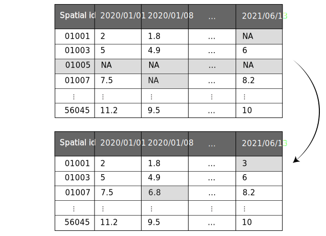

impute
======

**Description**

Impute the missing values of each covariate in the input data based on the observed values for that covariate using the KNN imputation method and remove the spatial units which have all missing values for a covariate.
To impute each of the covariates using the knn method, first values of that covariate are arranged as a data frame with each row representing a spatial unit and each column representing a temporal unit (see :numref:`target fig 4`). The KNN imputation method is applied on this data frame to fill up the missing values of the covariate.

**Usage**

.. py:function:: preprocess.impute(data, column_identifier = None, verbose = 0)

**Parameters**

.. csv-table::   
   :header-rows: 1
   :widths: 1 , 3, 15
   :file: impute_in.csv

.. note:: The gap in the sequence of temporal id levels is not allowed. More clearly if input data contains columns 'temporal id level 1','temporal id level 2', … , 'temporal id level x' , 'temporal id level x+2', the column  'temporal id level x+2' is not considered in identifying the temporal units and will be removed from the data. 

**Returns** 

.. csv-table::   
   :header-rows: 1
   :widths: 1 , 3, 15
   :file: impute_out.csv

**Example** 

.. code-block:: python

   import pandas as pd
   from stpredict.preprocess import impute

   df = pd.read_csv('data.csv')
   imp = impute(data = df)

.. _target fig 4:

   Imputation of missing values in temporal data

