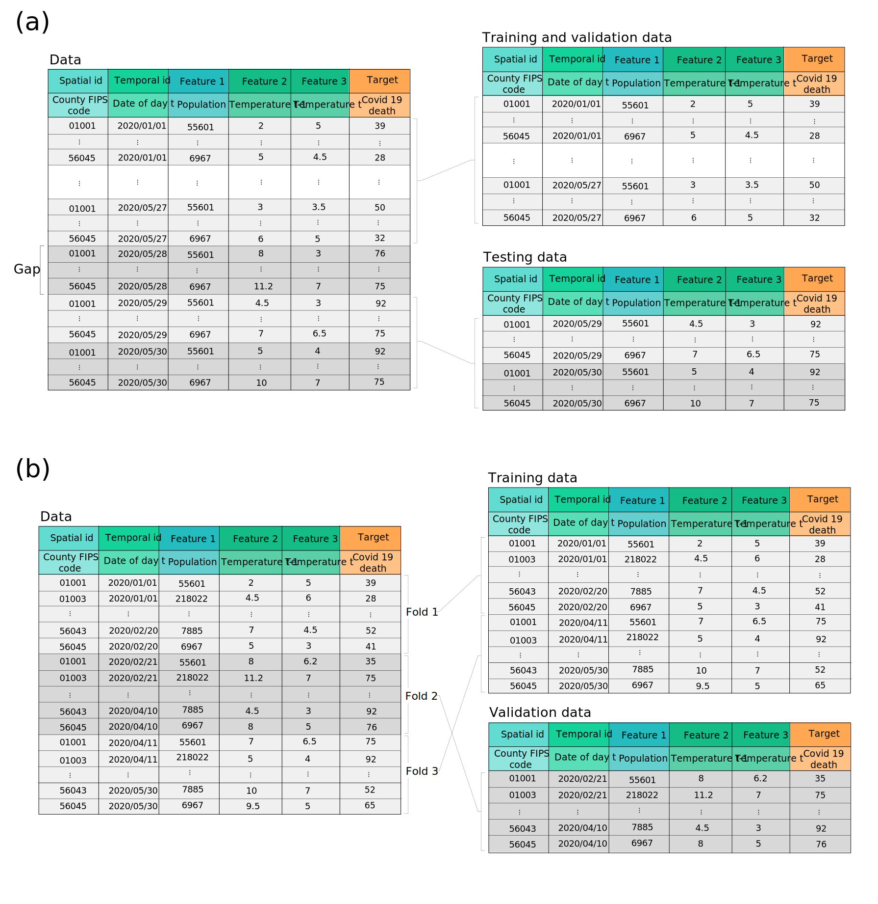

split_data
==========

**Description**

   Splitting the preprocessed data into training, validation, and testing sets with regard to user preference. The function allows temporal splitting of the data, wherein the test set is selected from the last temporal units in the data, and a number of previous temporal units of the test set (here denoted by the Gap) is excluded from the data to simulate the situation of real prediction in which we do not have access to the information of the forecast_horizon - 1 units before the time point of the target variable. :numref:`target fig 6`.a shows the temporal splitting of a sample preprocessed data. The cross validation method is also supported in the function, which is depicted in :numref:`target fig 6`.b.

**Usage**

.. py:function:: predict.split_data(data, splitting_type = 'instance', instance_testing_size = None, instance_validation_size = None, instance_random_partitioning = False, fold_total_number = None, fold_number = None, forecast_horizon = 1, granularity = 1, verbose = 0)

**Parameters**

.. csv-table::   
   :header-rows: 1
   :widths: 1 , 3, 15
   :file: split_data_in.csv

**Returns** 

.. csv-table::   
   :header-rows: 1
   :widths: 1 , 3, 15
   :file: split_data_out.csv

**Example** 

.. code-block:: python

   import pandas as pd
   from stpredict.predict import split_data
   
   df = pd.read_csv('./historical_data h=1.csv')
   training_data, validation_data, testing_data, gap_data = split_data(data = df, 
                                           splitting_type = 'instance', instance_testing_size = 0.2, 
                                           instance_validation_size = 0.3, forecast_horizon = 2)
.. _target fig 6:

   
   Different types of data splitting. (a) Temporal splitting of a sample preprocessed data with forecast_horizon = 2, and instance_testing_size = 2, (b) Cross validation with fold_total_number = 3, fold_number = 2.